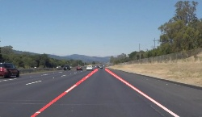
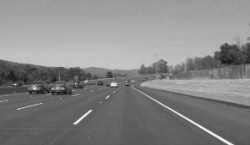
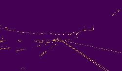
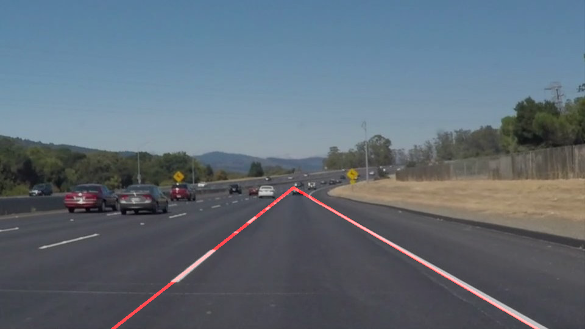

# Finding Lane Lines on the Road

This is my first project of [Self-Driving Car Engineer nanodegree program](https://www.udacity.com/course/self-driving-car-engineer-nanodegree--nd013) in udacity.

---

## Overview

The goals / steps of this project are the following:
* Make a pipeline that finds lane lines on the road, using opencv and python
* Reflect on my work

...

Original Image             | Desired Image         |
:-------------------------:|:-------------------------:|
   |   

[//]: # (Image References)

---

## Reflection

### 0. Setting

To set it up to run this script at first, I followd this [starter kit](https://github.com/udacity/CarND-Term1-Starter-Kit) with docker. If you use mac and docker was installed successfuly, you can run jupyter notebook on your local machine by the command below.

```sh
docker run -it --rm --entrypoint "/run.sh" -p 8888:8888 -v `pwd`:/src udacity/carnd-term1-starter-kit
```

### 1. Pipeline step

My pipeline consisted of 5 steps.

First, I converted the images to grayscale, and then applied Gaussian blur to that grayscaled image so that I can reduce image noise. Gaussian blur can be skipped because cv2.Canny I use next step do blur internally, by kernel size 5 × 5.
However, I didn't skip because I found that 3 × 3 case made better result than that of 5 × 5. 

To detect edges in blurred image, I use Canny edge detection. I decide high / low threshold, 255 and 255/3 for that Canny but I couldn't find a convinced reason for that range. While seeing test images, I found that lane lines are mostly located in specific area, so I put four sided polygon to mask at the bottom half of the image.

I got masked edge image from the pre-processing steps above. I implemented a Hough Transform to decide which lines pipelien should detect in image. I found lines seem close to the expected output, but there's a problem. Lines I found was often broken in the middle of lane when it couldn't see edge at the bottom of image. 

In order to draw a single line on the left and right lanes, I extrapolate line with numpy.polyfit. I do that by simply plugging in points that are outside of data set. I put original image and red line drawn image together.

...

To wrap it up, Here is 5 steps in my pipeline.
1. Convert original image to grayscale
2. Applied Gaussian blur to grayscale image
3. Detected edges in image by Canny edge detection
4. Masked edge image to see only usuful region in image
5. Drawed line in image by Hough transform.

...

1 Grayscaled             | 2 Gaussian Blurred         | 3 Edge                   |
:-------------------------:|:-------------------------:| :-------------------------:|
   |    | 

4 Masked Edges             | 5 Red Line         | 6 Output(Red Line + Original) |
:-------------------------:|:-------------------------:| :-------------------------:|
   |    | 

The output in video format looks like this.


You can see the codebase in [my jupyter notebook](./P1.ipynb).

### 2. Potential shortcomings with my current pipeline

One potential shortcoming would be that pipeline find it hard to get edges when it is bad weather like strong snow in night. Also, I only tested image in day but night image might make bad result because border can be a bit unseen relatively.

Another shortcoming could be bad result when riding on the hill, mountain, and those of high hill place. Pipeline didn't consider the case that lane has slope.


### 3. Improvements to pipeline

A possible improvement would increate test dataset to see how bad or good my current pipleline can detect lane lines. Regardless of result, it might need more data.

Another potential improvement could implement another edge detection or Hough transform to detect the lines in image. In addition to that, pre-process steps have more room to improvement. In this project, I manually change the paramenters in preprocess step, but it can improve more, like [this approach](https://medium.com/@maunesh/finding-the-right-parameters-for-your-computer-vision-algorithm-d55643b6f954)

---
## Reference
[How to extrapolate lines with numpy.polyfit](https://peteris.rocks/blog/extrapolate-lines-with-numpy-polyfit/)